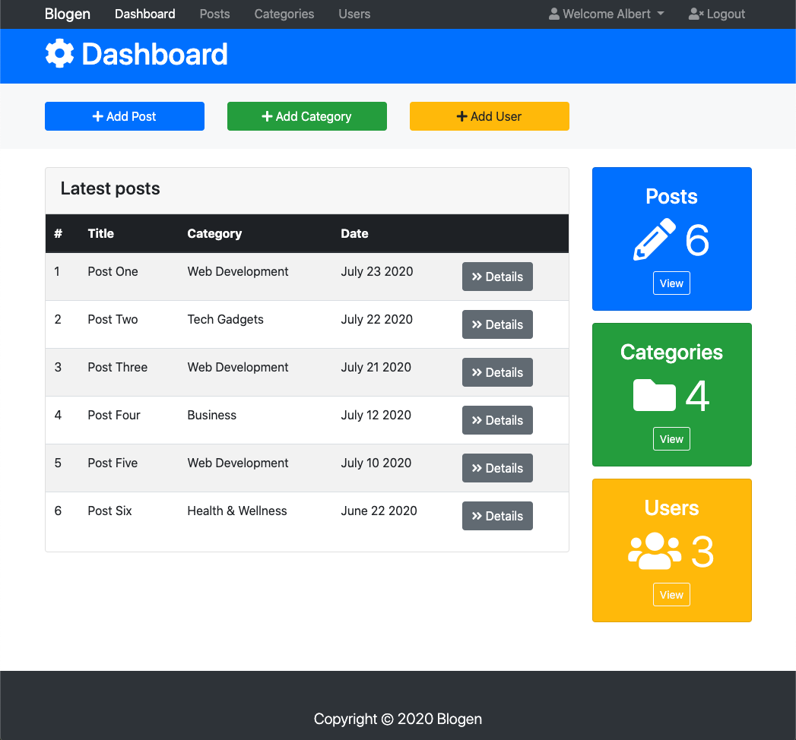
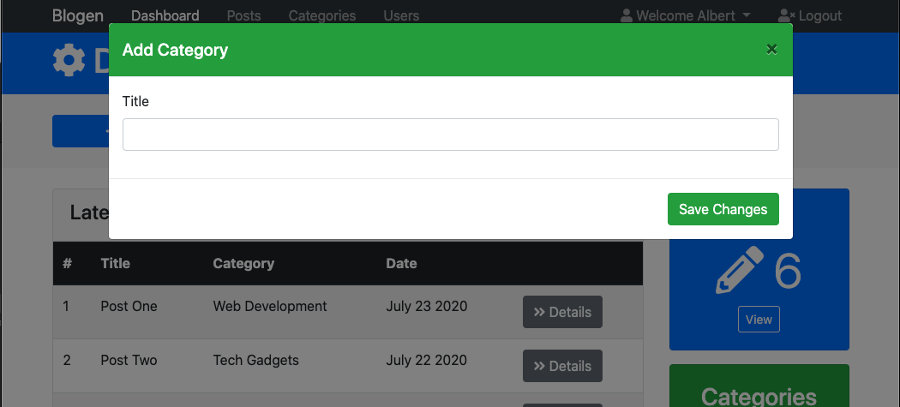
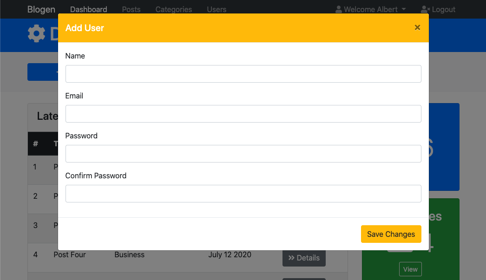
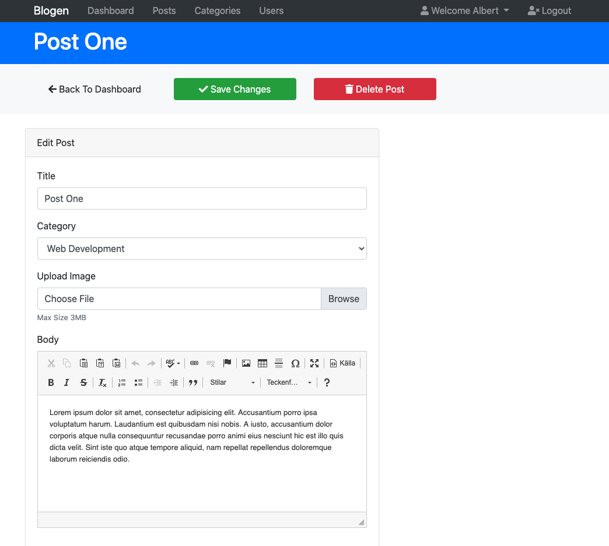
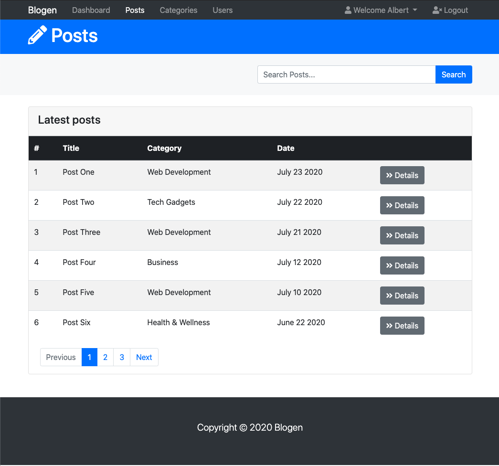
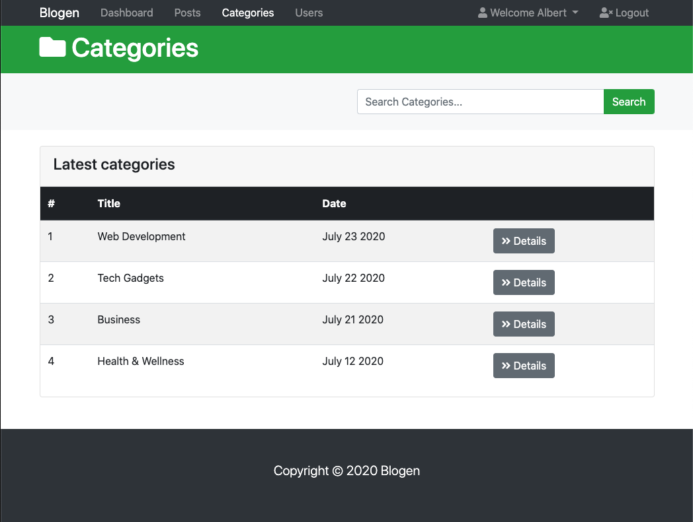
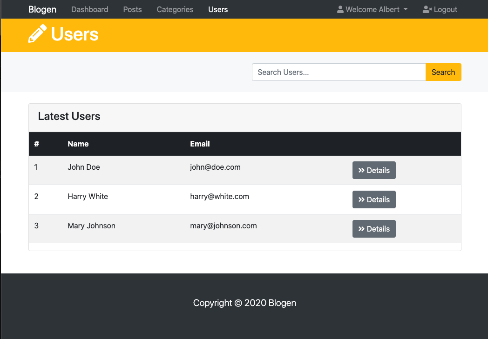
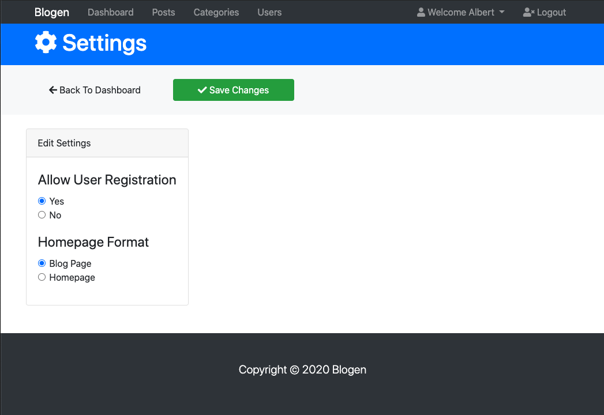
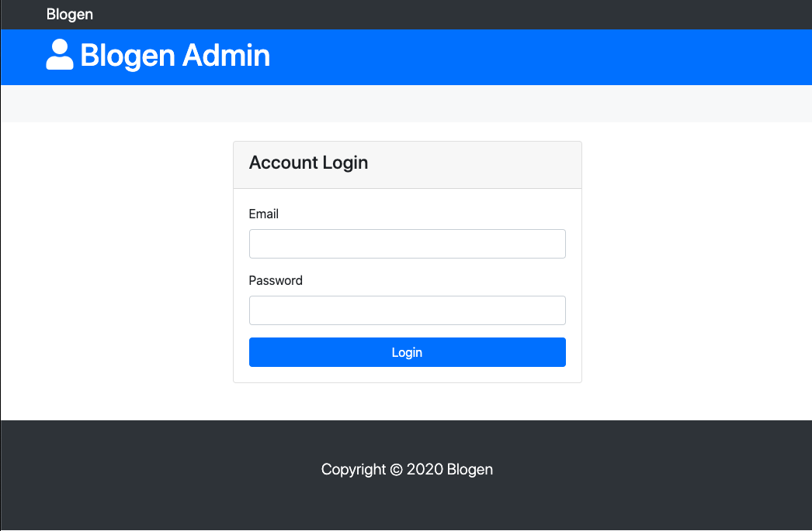

# Blogen - An application UI for admin of a blog portal

This user interface is built with Bootstrap.

Using ckeditor for eg writing posts:
(https://cdn.ckeditor.com/)

# Screenshots

Dashboard

Add Post modal

Add Category modal

Add User modal

Details page

Posts page

Categories page

Users page

Profile page

Settings page

Login page

## Author

- Albert Stjärne (https://github.com/AlbertStjarne)
